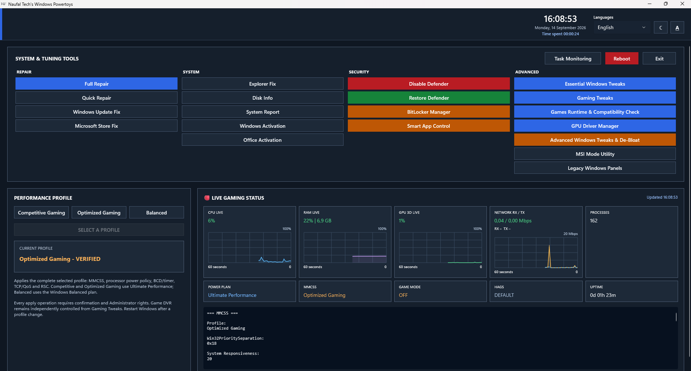
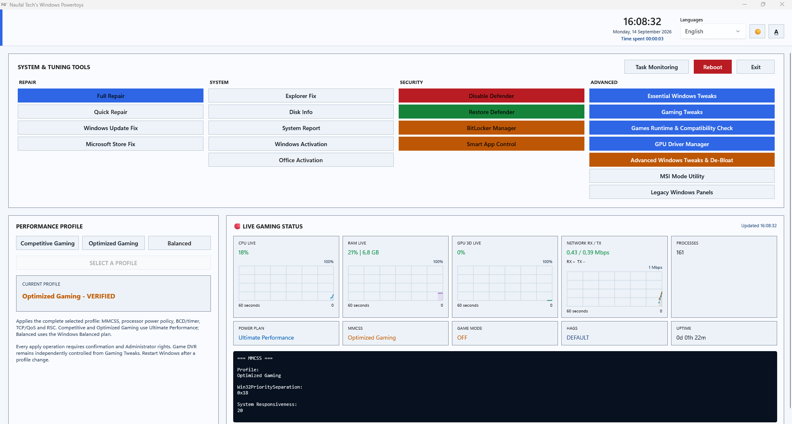

# Naufal Windows Powertoys

[](CHANGELOG.md)
[](#quick-start)
[](LICENSE)
[](#languages--project-status)

A native Windows dashboard to **repair system components**, **manage Windows apps**, **review privacy settings**, and **configure gaming and performance options**—with live monitoring and operation progress in one place.

Developed by **Muhammad Naufal Alauddin**. Independent, open-source, and under active development. **Not affiliated with Microsoft or Microsoft PowerToys.**



<details>
<summary>View the light theme</summary>



</details>

*Screenshots show an earlier development build; current labels and controls may differ.*

---

## Quick Start

> **Back up important data before applying tweaks.** System-changing operations may require Administrator privileges. Review each option's warning; do not apply every tweak indiscriminately.

1. Visit [Releases](https://github.com/mnaufalalauddin/Naufal-Tech-s-Windows-Powertoys/releases) and choose a maintainer-published x64 installer, if available. If no suitable installer is attached, [build from source](#build--develop).
2. Run the installer, open **Naufal Windows Powertoys**, and review the first-run prerequisites.
3. Choose a catalog or performance profile, read its description, and apply only the changes you need.
4. Check the separate progress window and verification results. Restart Windows when the option requires it.

**Windows 10 / 11 x64 are intended targets.** Feature availability depends on your Windows build, edition, hardware, and installed components. Not every configuration has been validated. Some downloads and app recovery operations require Internet access and WinGet.

**The current installer is unsigned.** Verify the download source and any published SHA-256 hash; do not disable system protection just to run it. GitHub's **Code → Download ZIP** downloads source code, not a ready-to-run application.

---

## What's Included

| Category | Highlights |
| --- | --- |
| **Repair** | Full Repair, Quick Repair, Windows Update Fix, Microsoft Store Fix, and Explorer Fix. |
| **System** | Disk information, system reports, and Windows / Office activation status tools. A valid license is still required. |
| **Tweaks & De-Bloat** | Essential and Gaming catalogs, service controls, privacy and advertising policies, and supported AI-related settings. |
| **Built-in Windows Apps** | Alphabetical app removal / recovery, including OneDrive, with Recommended, Optional, and Not Recommended removal guidance. |
| **Security & Compatibility** | BitLocker Manager, automatic device-encryption policy, Defender controls, Smart App Control, GPU Driver Manager, runtime checks, and MSI Mode Utility. |
| **Monitoring & Interface** | CPU, RAM, GPU 3D and network graphs; Task Monitoring; per-operation progress; Light/Dark themes; text scaling; and 23 language choices. |

## Performance Profiles

Choose a profile from the dashboard, review its confirmation, and inspect verification results after applying it.

| Profile | Purpose |
| --- | --- |
| **Competitive Gaming** | Apply the project's competitive-gaming configuration. |
| **Optimized Gaming** | Apply an alternative gaming-oriented configuration. |
| **Balanced** | Apply the project's balanced configuration using the Windows Balanced power plan. |

Profiles manage multiple settings, not just the power plan. **No profile guarantees higher FPS or lower latency** on every PC. These are application UI profiles, not command-line automation presets.

<details>
<summary><strong>Important: Apply, OFF, Restore, and safety</strong></summary>

- ON can mean a disabling/removal tweak is applied—not that the underlying Windows feature is enabled. Read the description.
- OFF and Restore have different meanings for some options. Restore uses captured state where available; some options offer documented Windows-default fallbacks. Vendor-specific defaults cannot always be inferred safely.
- Restore all defaults can intentionally discard saved pre-change state for applicable items. Read the confirmation.
- Reinstalling an app does not recover deleted personal data. Recovery can require Internet access, Store availability, and an appropriate license.
- Disabling update, printing, biometric, networking, or security components can interrupt those functions. Security reductions are not general-purpose performance recommendations.
- Retain your BitLocker recovery key securely. Preventing automatic device encryption does not decrypt an already encrypted drive.
- Keep restore backups. A green verification result covers the implemented checks, not every possible side effect.

Default installation: `C:\Program Files\Naufal Tech's Limited\Naufal Windows Powertoys`.

Per-user application files: `%LOCALAPPDATA%\Naufal Windows Powertoys`. Some snapshots live in the registry or other feature-specific locations; this folder alone is not a complete backup.

</details>

---

## Build & Develop

Built with **C# / WinUI**, **.NET 10**, **Native AOT**, and **Inno Setup 7**.

Use a Windows x64 development PC with Git, .NET 10 SDK, Visual Studio Windows / WinUI build support, the **Desktop development with C++** workload, MSVC x64 tools, a Windows SDK, and Inno Setup 7. The recorded packaging version is **7.1.0**.

From **PowerShell 7 with the Visual Studio x64 developer environment loaded**:

```powershell
git clone https://github.com/mnaufalalauddin/Naufal-Tech-s-Windows-Powertoys.git
Set-Location Naufal-Tech-s-Windows-Powertoys
.\build-installer.ps1
```

The script restores dependencies, publishes the self-contained Native AOT application, includes dependency notices, and builds the installer:

```text
artifacts\installer\Naufal-Windows-Powertoys-Setup-8.0.0-x64.exe
```

Build tools are not required to run the packaged application. Generated binaries and private runtime data are excluded from Git.

<details>
<summary>Debug build, regression checks, and source map</summary>

```powershell
dotnet build ".\Naufal Tech's Windows Powertoys.csproj" -c Debug -p:Platform=x64

dotnet run --project .\Tests\ProfileVerification\ProfileVerification.Tests.csproj
dotnet run --project .\Tests\Localization\Localization.Tests.csproj
.\Tests\ParityAudit\Test-CatalogInteraction.ps1
.\Tests\ParityAudit\Test-ProjectIdentity.ps1
```

The functional and localization checks do not apply Windows tweaks. The separate backend-free native UI test host exercises layout and language switching:

```powershell
.\Tests\HeaderLayout\Test-HeaderLayout.ps1 -NativeAot -Languages en,id,ar,ur
```

| Source | Purpose |
| --- | --- |
| `MainWindow.xaml`, `MainWindow*.cs` | Dashboard, dialogs, and catalog interaction. |
| `*Service.cs`, catalog and policy files | Inspection, repair, tweaks, app management, and restore behavior. |
| `UiTranslation*.cs`, `NativeUiCatalog*.cs` | Localization resources and dynamic display templates. |
| `Installer/`, `build-installer.ps1` | Installer definition, packaging, icons, and dependency notices. |
| `Tests/` | Functional, localization, static, and native UI checks. |

The project file retains its historical filename. Passing tests is not proof that every system-changing operation works on every Windows configuration; use a disposable VM or dedicated test PC for risky changes.

</details>

---

## Languages & Project Status

**23 interface languages:** English, Indonesian, German, French, Arabic, Tagalog, Vietnamese, Simplified Chinese, Traditional Chinese, Thai, Russian, Ukrainian, Portuguese, Japanese, Korean, Urdu, Tamil, Hindi, Malay, Javanese, Balinese, Swedish, and Spanish.

**Active development—not declared complete.** Remaining work includes dynamic messages, application-authored logs, standard installer localization, and live verification of Windows Photo Viewer image opening. The installer's program-information page offers 23 languages; the entire setup UI does not yet have equivalent coverage.

Technical identifiers, product names, and external diagnostics may retain their original wording. Dated build and test results are recorded in the [changelog](CHANGELOG.md), not presented as a live CI status.

---

## Resources

- [Published releases](https://github.com/mnaufalalauddin/Naufal-Tech-s-Windows-Powertoys/releases)
- [Development history and known limitations](CHANGELOG.md)
- [Report a bug or request a feature](https://github.com/mnaufalalauddin/Naufal-Tech-s-Windows-Powertoys/issues)
- [Source license](LICENSE) · [Third-party notices](THIRD-PARTY-NOTICES.txt)

## Support & Contribute

If the project helps you, consider starring the repository. Bug reports, translation corrections, reproducible test cases, and focused pull requests are welcome.

Include your Windows build, app version, language, selected option, exact steps, and relevant output when reporting a problem. **Remove private information—never upload recovery keys, credentials, product keys, or personal backups.** Preserve restore behavior and add relevant tests when changing system-modifying code.

[View contributors](https://github.com/mnaufalalauddin/Naufal-Tech-s-Windows-Powertoys/graphs/contributors) · [View pull requests](https://github.com/mnaufalalauddin/Naufal-Tech-s-Windows-Powertoys/pulls)

---

## License

[MIT License](LICENSE) · Copyright © 2026 **Muhammad Naufal Alauddin**. Provided without warranty. Dependencies retain their own licenses; see [THIRD-PARTY-NOTICES.txt](THIRD-PARTY-NOTICES.txt).

Third-party names, trademarks, and artwork remain subject to their owners' rights. This project is independent of Microsoft and Microsoft PowerToys.
